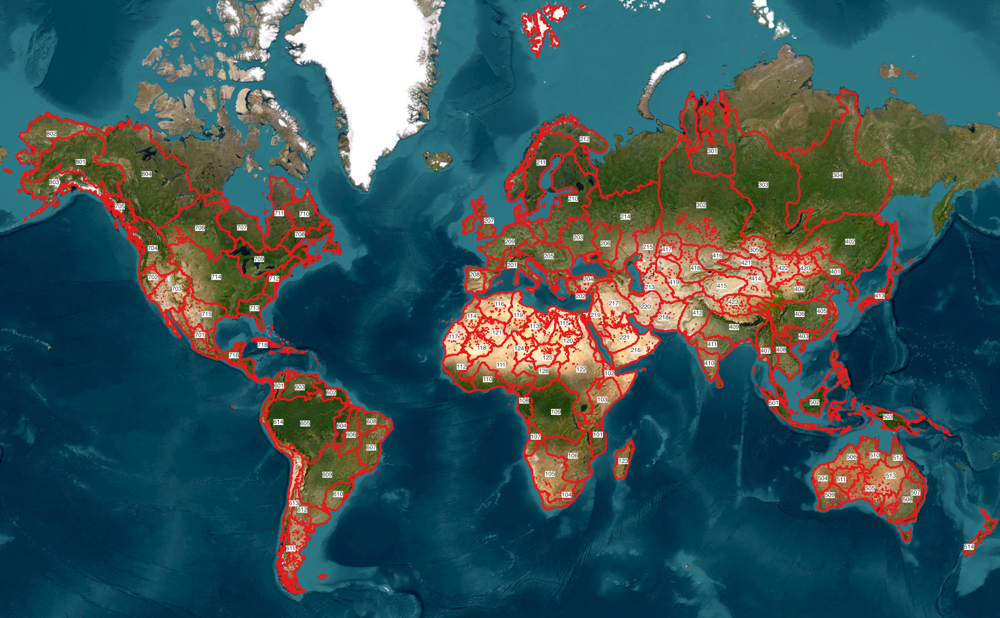

# ECFLOW RAPID workflow for GEOGloWS


*Coverage of GEOGloWS VPUCode basins. Source: [Riley Hales](mailto:rchales@byu.edu).*

## Installation

```bash
cd geoglows_ecflow/
pip install .
```

```bash
# development installation
cd geoglows_ecflow/
pip install -e .
```

## Non-Python Dependencies

- rapid>=20210423
- ecflow>=5.11.3
- nco>=5.1.8
- ksh>=2020.0.0

## geoglows_ecflow configuration file (config.yml)

```yaml
# ecflow variables
python_exec: /path/to/python
ecflow_home: /path/to/ecflow_home
ecflow_bin: /path/to/ecflow_client  # Required for local run
local_run: false
ecflow_entities:
  suite:
    name: geoglows_forecast
    logs: /path/to/suite_log
  family:
    - name: rapid_forecast_family
      suite: geoglows_forecast
    - name: init_flows_family
      suite: geoglows_forecast
    - name: esri_table_family
      suite: geoglows_forecast
    - name: nc_to_zarr_family
      suite: geoglows_forecast
    - name: archive_to_aws_family
      suite: geoglows_forecast
  task:
    - name: forecast_prep_task
      variables:
        - PYSCRIPT
        - IO_LOCATION
        - RUNOFF_LOCATION
        - ECF_FILES
      suite: geoglows_forecast
    - name: esri_table_task
      variables:
        - PYSCRIPT
        - OUT_LOCATION
        - RETURN_PERIODS_DIR
        - LOG_FILE
        - NCES_EXEC
      suite: geoglows_forecast
    - name: day_one_forecast_task
      variables:
        - PYSCRIPT
        - IO_LOCATION
        - ERA_LOCATION
        - FORECAST_RECORDS_DIR
        - LOG_DIR
      suite: geoglows_forecast
    - name: rapid_forecast_task
      variables:
        - PYSCRIPT
        - ECF_FILES
        - JOB_ID
        - RAPID_EXEC
        - EXEC_DIR
        - SUBPROCESS_DIR
      suite: geoglows_forecast
    - name: init_flows_task
      variables:
        - PYSCRIPT
        - ECF_FILES
        - VPU
      suite: geoglows_forecast
    - name: nc_to_zarr_task
      variables:
        - PYSCRIPT
        - ECF_FILES
        - VPU
      suite: geoglows_forecast
    - name: archive_to_aws_task
      variables:
        - PYSCRIPT
        - ECF_FILES
        - AWS_CONFIG
        - VPU
      suite: geoglows_forecast

# rapid variables
rapid_exec: /path/to/rapid_exec
rapid_exec_dir: /path/to/rapid_exec_dir
rapid_subprocess_dir: /path/to/rapid_subprocess_dir
rapid_io: /path/to/rapid_io
runoff_dir: /path/to/runoff_dir
era_dir: /path/to/era_dir
forecast_records_dir: /path/to/forecast_records_dir

# nco variables
nces_exec: /path/to/nces_exec

# aws variables
aws_config: /path/to/aws_config.yml
```

## AWS configuration file (aws_config.yml)

```yaml
# aws credentials
aws_access_key_id: AWS_ACCESS_KEY_ID
aws_secret_access_key: AWS_SECRET_ACCESS_KEY

# aws s3 bucket
bucket_name: S3_BUCKET_NAME
```

## Custom ecflow server start (local_ecflow_start.sh)

```bash
#!/bin/bash
export ECF_PORT=2500
export ECF_HOST=localhost

ecflow_start.sh -d /path/to/ecflow_home
```

## Local run example

```Python
import subprocess
from geoglows_ecflow import geoglows_forecast_job, client

# Start server
subprocess.run(['bash', '/path/to/local_server_start.sh'])

# Create definition
geoglows_forecast_job.create("/path/to/config.yml")

# Add definition to server
client.add_definition("/path/to/definition.def", "<HOST>:<PORT>")

# Begin definition
client.begin("definition_name")
```

## Run tests

```bash
cd geoglows_ecflow/
pip install -e .[test]

# run tests
pytests tests/

# run tests with coverage
pytests --cov geoglows_ecflow tests/
```
