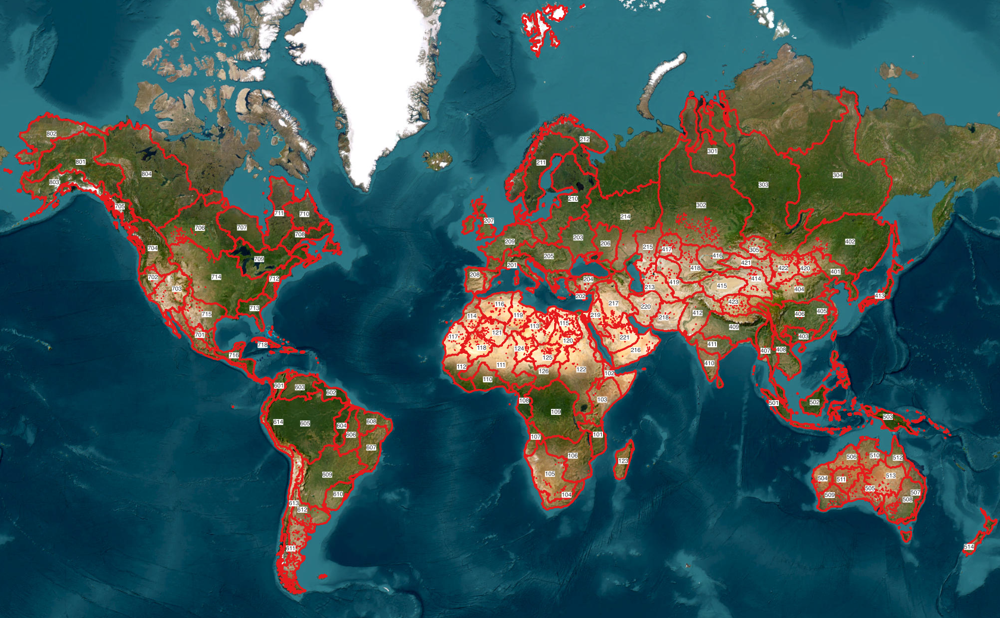

# ECFLOW workflow for GEOGloWS streamflow forecasting


*Coverage of GEOGloWS VPUCode basins. Source: [Riley Hales](mailto:rchales@byu.edu).*

## Installation

```bash
cd geoglows_ecflow/
pip install .
```

```bash
# development installation
cd geoglows_ecflow/
pip install -e .
```

## Non-Python Dependencies

- ecflow>=5.11.3,<5.17
- nco>=5.1.8
- ksh>=2020.0.0

## geoglows_ecflow configuration file (config.yaml)

The deployment configuration is a plain YAML file. Copy
[`config.example.yaml`](config.example.yaml) to `config.yaml` and edit the
values for your environment (`config.yaml` is gitignored so secrets stay out
of version control). Values like `%SCHOST:ab%` are ecFlow variables passed
through verbatim, and `{includes}`/`{scripts}` are sdeploy search-path
placeholders.

```yaml
name: suite_name
mode: test                 # 'test' or 'prod'
first_date: "YYYYMMDD"
first_barrier: "YYYYMMDD"
vpu_list: []
ens_members: 51
mars_workers: 3
script_extension: ".ecf"

expver: geoglows
exparch: /path/to/archive
iniexparch: /path/to/init_archive
staticdata: /path/to/assets
workroot: /path/to/workroot

# suite's source code
source:
  root: /path/to/source
  builder: geoglows_ecflow.workflow.builders.builder
  includes: "scripts/troika:suites/scripts/tems:{includes}"
  scripts: "scripts/tems:{scripts}"

# deploy location
target:
  root: /path/to/deploy_location

# where to run computations
jobs:
  manager:
    name: troika
  root: /path/to/job_root
  limit: 26
  destinations:
    default:
      host: "%SCHOST:ab%"
      bkup_host: "%SCHOST_BKUP%"
      user: user_name
      queue: nf
      account: ECACCOUNT
      sthost: sthost
    parallel:
      host: "%SCHOST:ab%"
      bkup_host: "%SCHOST_BKUP%"
      user: user_name
      queue: nf
      ncpus: "12"
      mem: "1000"

# GEOGloWS software packages installed alongside the suite
packages:
  scripts:
    srcdir: /path/to/source/scripts
```

## AWS configuration file (aws_config.yml)

```yaml
# aws credentials
aws_access_key_id: AWS_ACCESS_KEY_ID
aws_secret_access_key: AWS_SECRET_ACCESS_KEY

# aws s3 bucket
bucket_forecast_archive: S3_BUCKET_NAME
bucket_maptable_archive: S3_BUCKET_NAME
```

## Custom ecflow server start (local_ecflow_start.sh)

```bash
#!/bin/bash
export ECF_PORT=2500
export ECF_HOST=localhost

ecflow_start.sh -d /path/to/ecflow_home
```

## Local run example

Generate the suite definition (via CLI or Python):

```bash
gdeploy --config /path/to/config.yaml
```

```python
from geoglows_ecflow.workflow.create import main
main("/path/to/config.yaml")
```

Start a local ecflow server, then load and begin the suite:

```bash
bash /path/to/local_ecflow_start.sh
```

```python
from geoglows_ecflow import client

client.add_definition("/path/to/deploy_dir/suite.def", "localhost:2500")
client.begin("suite_name", "localhost:2500")
```
